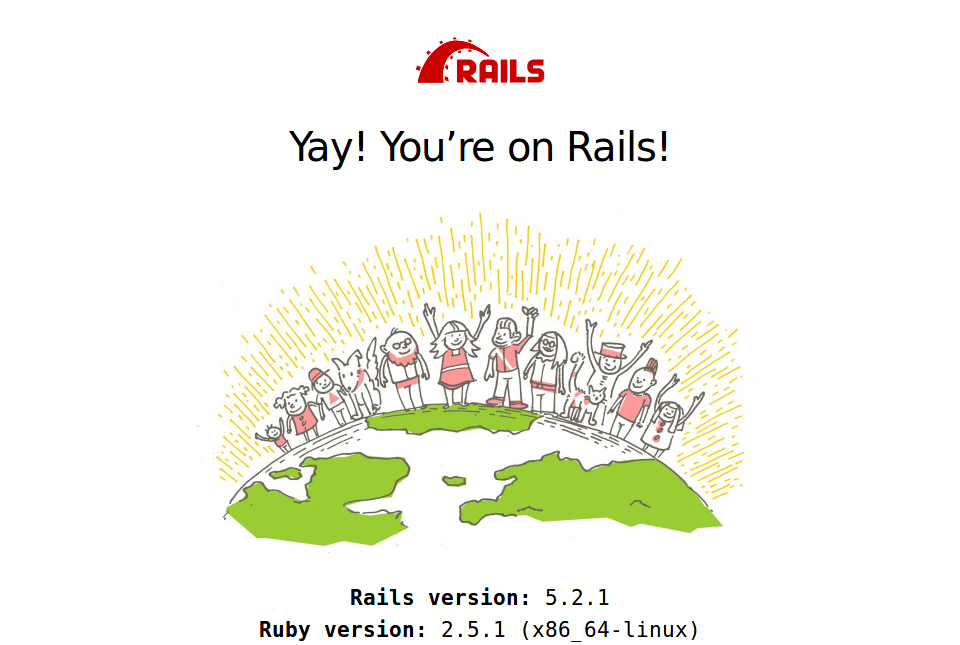
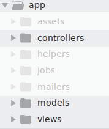

# Touiteur livecode 👩💻

### Avant-propos
Le code et les lignes de commandes sont présentés dans des cadres :

📄
```ruby
# example.rb
# comme celui-ci
```

ou

💻
```sh
# celui-ci
```

**Légende :**

📄 Il s'agit de code. Il s'écrit dans un fichier, toutes les lignes peuvent être copiées d'un coup. La première ligne est le chemin vers le fichier concerné.

💻 Il s'agit de lignes de commande, **chaque ligne doit être taper une par une dans le terminal**. Il faut appuyer sur `Entrer` après chaque ligne.


## Création de l'application

Nous allons créer un clone de Twitter (en beaucoup plus simple !). Notre logique métier s'articulera donc autour de _messages_. Nous allons pouvoir LISTER et CRÉER des _messages._

Voici la ligne de commande pour demander à Rails de créer l'application :

💻

```sh
rails new -T -C --skip-yarn --skip-bootsnap touiteur-demo
```

Rails va générer un dossier avec tous les fichiers nécessaires à l'application.

Pour se déplacer à l'intérieur du nouveau dossier, il faut éxecuter la commande suivante :

💻

```sh
cd touiteur-demo
```

On peut dès à présent vérifier que notre application fonctionne déjà !

Pour cela, il nous faut lancer le serveur Rails avec la commande

💻

```sh
rails server
```

Depuis notre navigateur, nous pouvons acceder à notre application à l'adresse [http://locahost:3000](http://localhost:3000).




Nous pouvons alors accéder à notre projet depuis notre éditeur de texte Sublime Text **depuis un nouveau terminal** avec la commande

💻

```sh
stt .
```

Nous retrouvons l'ensemble des dossiers et des fichiers de l'application.


Il y en a beaucoup ! Nous allons nous concentrer sur seulement certains d'entre-eux.

### app

Le dossier **app** contient les dossiers dans lesquels nous allons ajouter les fichiers de notre logique métier.



Les dossiers que l'on va utiliser dans un premier temps sont **controllers**, **models** et **views**.

### routes.rb

Nous allons aussi utiliser le fichier **config/routes.rb**.

## Notre première page

Nous allons créer une page d'accueil **home**, qui n'est pas lié à notre logique métier pas de lien avec les _messages_ pour cette première page.

Cette page sera accessible à la racine `/` de notre site à la place de la page _Yay! You’re on Rails!_, c'est à dire l'adresse `http://localhost:3000/`.

Pour cela nous avons besoin d'un controller qui va gérer les pages non reliées à notre logique métier (on pourrait par exemple avoir une page de contact, une page présentant l'équipe, une page avec les conditions générales, etc.. Ce controller gère des **pages** et nous souhaitons avoir une page **home**, donc nous pouvons lancer la commande :

💻

```sh
rails generate controller pages home --no-assets
```

Nous avons alors un nouveau fichier **app/controllers/pages_controller** et un nouveau dossier **app/views/pages** contenant un fichier **home.html.erb**.

Ouvrons **app/views/pages/home.html.erb** et personnalisons-le un peu !

📄

```erb
<!-- app/views/pages/home.html.erb -->
Bienvenue sur Touiteur !
```

Nous pouvons voir le fruit de notre travail à l'adresse `http://localhost:3000/pages/home` :tada:

Nous souhaitons que cette page s'affiche à la racine de l'application donc nous devons modifier le fichier **config/routes.rb** :

📄

```ruby
# config/routes.rb
Rails.application.routes.draw do
  root to: "pages#home"
end

```

Nous avons maintenant notre page **home** à la bonne adresse  [http://locahost:3000/](http://localhost:3000/) !

