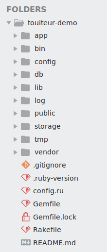

# Touiteur livecode 👩💻

### Avant-propos
Le code et les lignes de commandes sont présentés dans des cadres :

📄
```ruby
# example.rb
# comme celui-ci
```

ou

💻
```sh
# celui-ci
```

**Légende :**

📄 Il s'agit de code. Il s'écrit dans un fichier, toutes les lignes peuvent être copiées d'un coup. La première ligne est le chemin vers le fichier concerné.

💻 Il s'agit de lignes de commande, **chaque ligne doit être taper une par une dans le terminal**. Il faut appuyer sur `Entrer` après chaque ligne.


### Création de l'application

Voici la ligne de commande pour demander à Rails de créer l'application :

💻

```sh
rails new -T -C --skip-yarn --skip-bootsnap touiteur-demo
```

Rails va générer un dossier avec tous les fichiers nécessaires à l'application.

Pour se déplacer à l'intérieur du nouveau dossier, il faut éxecuter la commande suivante :

💻

```sh
cd touiteur-demo
```

Nous pouvons alors ouvrir notre éditeur de texte Sublime Text directement pour ce dossier avec la commande

```sh
stt .
```

Nous retrouvons l'ensemble des dossiers et des fichiers de l'application.



