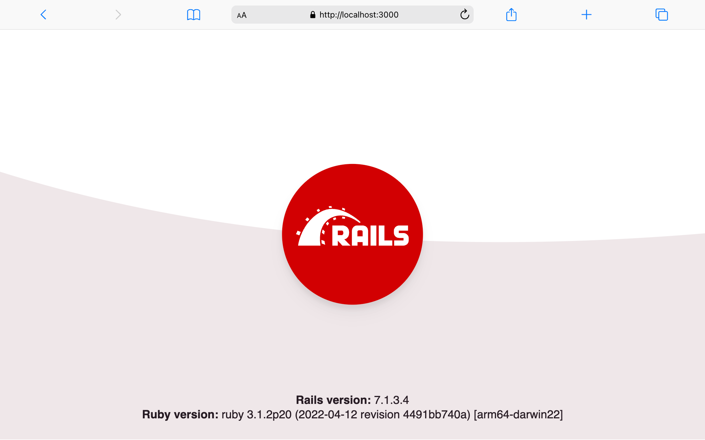
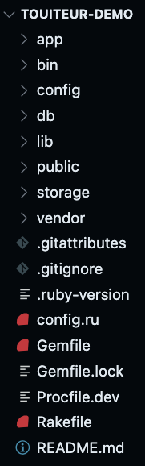
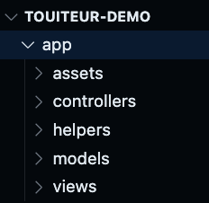

# Touiteur livecode 👩💻

---

**⚠⚠ À lire obligatoirement ⚠⚠ À lire obligatoirement ⚠⚠ À lire obligatoirement ⚠⚠**

### Avant-propos
Le code et les lignes de commandes sont présentés dans des cadres :

📄
```ruby
# example.rb
# comme celui-ci
```

ou

💻
```sh
# celui-ci
```

**Légende :**

📄 Il s'agit de code. Il s'écrit dans un fichier, toutes les lignes peuvent être copiées d'un coup. La première ligne est le chemin vers le fichier concerné.

💻 Il s'agit de lignes de commande, **chaque ligne doit être tapée une par une dans le terminal**. Il faut appuyer sur `Entrer` après chaque ligne.

---

## Création de l'application

Nous allons créer un clone de Twitter (en beaucoup plus simple !). Notre logique métier s'articulera donc autour de _messages_. Nous allons pouvoir LISTER et CRÉER des _messages._

Voici la ligne de commande pour demander à Rails de créer l'application :

💻

```sh
rails new touiteur-demo -T -C --skip-bootsnap --skip-webpack-install
```

Rails va générer un dossier avec tous les fichiers nécessaires à l'application.

Pour se déplacer à l'intérieur du nouveau dossier, il faut éxecuter la commande suivante :

💻

```sh
cd touiteur-demo
```

On peut dès à présent vérifier que notre application fonctionne déjà !

Pour cela, il nous faut lancer le serveur Rails avec la commande :

💻

```sh
rails server
```

Depuis notre navigateur, nous pouvons acceder à notre application à l'adresse [http://localhost:3000](http://localhost:3000).




Nous pouvons alors accéder à notre projet depuis notre éditeur de texte Sublime Text **depuis un nouveau terminal** avec la commande :

💻

```sh
stt .
```

Nous retrouvons l'ensemble des dossiers et des fichiers de l'application.



Il y en a beaucoup ! Nous allons nous concentrer sur seulement certains d'entre-eux.

### app

Le dossier **app** contient les dossiers dans lesquels nous allons ajouter les fichiers de notre logique métier.



Les dossiers que l'on va utiliser dans un premier temps sont **controllers**, **models** et **views**.

### routes.rb

Nous allons aussi utiliser le fichier **config/routes.rb**.

## Principe du MVC


## Notre première page :rocket:

Nous allons créer une page d'accueil **home**, qui n'est pas liée à notre logique métier (aucun lien avec les _messages_ pour cette première page).

Cette page sera accessible à la racine `/` de notre site à la place de la page _Yay! You’re on Rails!_, c'est-à-dire à l'adresse `http://localhost:3000/`.

Pour cela nous avons besoin d'un controller qui va gérer les pages non reliées à notre logique métier (on pourrait par exemple avoir une page de contact, une page présentant l'équipe, une page avec les conditions générales, etc.). Ce controller gère des **pages** et nous souhaitons avoir une page **home**, donc nous pouvons lancer la commande :

💻

```sh
rails generate controller pages home --no-assets
```

Nous avons alors un nouveau fichier **app/controllers/pages_controller** et un nouveau dossier **app/views/pages** contenant un fichier **home.html.erb**.

Ouvrons **app/views/pages/home.html.erb** et personnalisons-le un peu !

📄

```erb
<!-- app/views/pages/home.html.erb -->
Bienvenue sur Touiteur !
```

Nous pouvons voir le fruit de notre travail à l'adresse `http://localhost:3000/pages/home` :tada:

Nous souhaitons que cette page s'affiche à la racine de l'application donc nous devons modifier le fichier **config/routes.rb**&nbsp;:

📄

```ruby
# config/routes.rb
Rails.application.routes.draw do
  root to: 'pages#home'
end
```

Nous avons maintenant notre page **home** à la bonne adresse  [http://localhost:3000/](http://localhost:3000/) !

:art: alors oui, ce n'est pas super beau mais on verra comment embellir tout ça après, patience :pray:

## Les messages

Notre objectif est de LISTER et CRÉER des messages. Nous avons donc besoin d'un modèle **message**. Un message a  deux propriétés : un contenu `content` et un auteur `author`.

Nous pouvons le créer grâce à la commande&nbsp;:

💻

```sh
rails generate model message content:text author:string
```

Nous avons deux nouveaux fichiers : **app/models/message.rb** et **db/migrate/20180912121554_create_messages.rb** ce dernier va permettre d'ajouter à la base de données une table `messages` grâce à la commande&nbsp;:

💻

```sh
rails db:migrate
```

### Création de messages depuis la console Rails 💻🤓

Nous voulons lister des messages, pour cela nous allons devoir tricher un peu et créer des messages directement depuis la console Rails car nous n'avons pas encore développé la fonctionnalité !

Pour ouvir une console Rails, il faut lancer la commande suivante&nbsp;:

💻

```sh
rails console
```

L'invite de commande commence maitenant par `irb(main):001:0> `, nous sommes dans la console Rails !

Les commandes de la console Rails sont indiquées par 💻🤓, comme pour le terminal, il faut les rentrer une par une et appuyer sur la touche `Entrer` pour les lancer.

Pour créer un message depuis la console nous tapons la commande suivante&nbsp;:

💻:nerd_face:

```ruby
Message.create(content: "Hello RailsGirls!", author: "Alice")
```

Créons-en un deuxième !

💻🤓

```ruby
Message.create(content: "I want to code more!", author: "Eve")
```

Nous avons maintenant deux messages dans la base de données. Nous pouvons le vérifier avec une dernière commande dans la console Rails&nbsp;:

💻🤓

```ruby
Message.all
```

Qui donne la réponse suivante&nbsp;:

```ruby
Message Load (1.2ms)  SELECT  "messages".* FROM "messages" LIMIT ?  [["LIMIT", 11]]
=> #<ActiveRecord::Relation [#<Message id: 1, content: "Hello RailsGirls!", author: "Alice", created_at: "2018-09-12 12:29:36", updated_at: "2018-09-12 12:29:36">, #<Message id: 2, content: "I want to code more !", author: "Eve", created_at: "2018-09-12 12:29:41", updated_at: "2018-09-12 12:29:41">]>
```

En lisant bien, on retrouve bien nos deux messages 🔍

Affichons-les dans notre application !

(Pour sortir de la console Rails, il faut faire `Ctrl` + `C`)

### Lister des messages (INDEX)

Pour lister les messages depuis notre application nous allons avoir besoin d'un controller pour les _messages_ et l'action (la page) dont nous avons besoin s'appelle INDEX. Nous allons donc utiliser la commande&nbsp;:

💻

```sh
rails generate controller messages index --no-assets
```

Nous avons alors un nouveau fichier **app/controllers/messages_controller** et un nouveau dossier **app/views/messages** contenant un fichier **index.html.erb**.

Nous avons pour l'instant accès à cette page depuis l'adresse `http://localhost:3000/messages/index`, modifions le fichier **config/routes.rb** pour pouvoir accéder à cette page depuis `http://localhost:3000/messages/`&nbsp;:

📄

```ruby
# config/routes.rb
Rails.application.routes.draw do
  root to: 'pages#home'
  get 'messages', to: 'messages#index'
end
```

Listons maintenant les messages sur cette page http://localhost:3000/messages/

Pour cela nous avons besoin de récupérer tous les _messages_ disponibles dans la base de données depuis le controller **messages_controller** (on l'avait fait depuis la console Rails tout à l'heure). Nous allons stocker cette liste dans une variable `@messages` qui sera accessible aussi dans le fichier de la vue **app/views/messages/index.html.erb**.

📄

```ruby
# app/controllers/messages_controller.rb
class MessagesController < ApplicationController
  def index
    @messages = Message.all
  end
end
```

Modifions maintenant notre vue pour afficher chaque message&nbsp;:

📄

```ruby
<!-- app/views/messages/index.html.erb -->
<h1>Les messages :</h1>

<% @messages.each do |message| %>
  <p><%= message.content %></p>
  <em><%= message.author %></em>
<% end %>
```

Et oui, on peut mettre du code html ET du code ruby dans la vue ! On verra plus précisement le html plus tard.

Nous voyons maintenant nos messages depuis la page http://localhost:3000/messages/ ! :tada:

### Créer un message (NEW, CREATE)

La création d'un message se fait en deux étapes.

- La première étape est de proposer un formulaire à l'utilisateur depuis une page NEW qui sera accessible à l'adresse http://localhost:3000/messages/new.

- La deuxième étape consiste à pouvoir poster les informations saisies par le formulaire pour créer un _message_ en base de données, depuis une action CREATE.

#### Le formulaire

Nous avons besoin d'une route dans le router **config/route.rb**, d'une action NEW dans le controller **app/controllers/messages_controller** et d'une vue **app/views/messages/new.html.erb**.

C'est parti !

📄

```ruby
# config/routes.rb
Rails.application.routes.draw do
  root to: 'pages#home'
  get 'messages', to: 'messages#index'
  get 'messages/new', to: 'messages#new', as: :new_message
end
```

La mention `as: :new_message` nous servira plus tard pour créer un lien en respectant les conventions de Rails.

📄

```ruby
# app/controllers/messages_controller.rb
class MessagesController < ApplicationController
  def index
    @messages = Message.all
  end

  def new
  end
end
```

📄

```ruby
<!-- app/views/messages/new.html.erb -->
<h1>Nouveau message</h1>
```

Si tout c'est bien passé, nous avons notre nouvelle page http://localhost:3000/messages/new. Il nous manque plus que notre formulaire !

Pour l'action INDEX, le controller avait passé à la vue une variable `@messages` qui contenait tous les messages. Pour notre action NEW, le controller va passer à la vue une variable `@message` qui contiendra un "message vide", prêt à être rempli par l'utilisateur. Pour cela, nous ajoutons une ligne de code dans le controller **messages_controller**&nbsp;:

📄

```ruby
# app/controllers/messages_controller.rb
class MessagesController < ApplicationController
  def index
    @messages = Message.all
  end

  def new
    @message = Message.new
  end
end
```

Nous pouvons maintenant créer notre formulaire dans la vue **new.html.erb**&nbsp;:

📄

```ruby
<!-- app/views/messages/new.html.erb -->
<h1>Nouveau message</h1>
<%= form_for @message do |f| %>
  <%= f.label :content, 'Contenu' %>
  <%= f.text_area :content %>

  <%= f.label :author, 'Auteur' %>
  <%= f.text_field :author %>

  <%= f.submit 'Ajouter mon message' %>
<% end %>
```

Nous pouvons maintenant admirer notre ~~superbe~~ formulaire http://localhost:3000/messages/new.

Pour l'instant, nous avons une erreur si nous soumettons notre nouveau message. C'est parce qu'il nous manque notre deuxième étape !

Nous avons besoin d'une route et d'une action CREATE dans le controller **app/controllers/messages_controller**. Pas besoin de vue, la création ne concerne pas l'utilisateur.

📄

```ruby
# config/routes.rb
Rails.application.routes.draw do
  root to: 'pages#home'
  get 'messages', to: 'messages#index'
  get 'messages/new', to: 'messages#new', as: :new_message
  post 'messages', to: 'messages#create'
end
```

Comme nous "postons" des informations lorsque nous soumettons le formulaire, nous utilisons le verbe `post` dans le routeur.

La création d'un message en base de donnée depuis les informations envoyées par l'utilisateur se fait de cette manière&nbsp;:

📄

```ruby
# app/controllers/messages_controller.rb
class MessagesController < ApplicationController
  # [...] le reste du fichier est caché ici 🙈

  def create
    @message = Message.create(message_params)
    redirect_to messages_path
  end

  private

  def message_params
    params.require(:message).permit(:content, :author)
  end
end
```

Cette partie est un peu dure à comprendre aujourd'hui 😳

En gros on permet à l'utilisateur de remplir les paramètres `content` et `author` pour un `message`, on crée le message puis on redirige l'utilisateur vers la page d'index des messages.

On peut également rajouter un lien vers le formulaire depuis l'index des messages.

Ici, on retrouve le `new_message` que nous avons spécifié dans les routes. Associé au helper `link_to`, nous pouvons simplement créer un lien sur notre page.

```ruby
<!-- app/views/messages/index.html.erb -->
<h1>Les messages :</h1>

<%= link_to 'Ecrire un message', new_message_path %>

<% @messages.each do |message| %>
  <p><%= message.content %></p>
  <em><%= message.author %></em>
<% end %>
```

Et voilà ! Nous avons maintenant la possibilité de créer des messages :tada:

### Afficher un message (SHOW)

C'est reparti pour un tour, il va nous falloir une route dans le routeur, une action SHOW dans le controller et d'une vue, on commence à avoir l'habitude ... 😏

📄 D'abord la route

```ruby
# config/routes.rb
Rails.application.routes.draw do
  root to: 'pages#home'
  get 'messages', to: 'messages#index'
  get 'messages/new', to: 'messages#new', as: :new_message
  post 'messages', to: 'messages#create'
  get 'messages/:id', to: 'messages#show', as: :message
end
```

Pour retrouver le message à afficher, nous allons devoir renseigner son `id`, qui est automatiquement ajouté au moment de l'enregistrement du message dans la base de données. En écrivant la route de cette manière, nous indiquons à Rails que l'id sera dynamque et nous pourront par exemple aller sur l'url `localhost:3000/messages/42` pour afficher le message avec l'id `42` :nerd_face:.

Encore une fois on précise à Rails comment nous souhaitons appeler notre route avec `as: :message`.

📄 Ensuite le controller

```ruby
# app/controllers/messages_controller.rb
class MessagesController < ApplicationController
  # [...] le reste du fichier est caché ici 🙈

  def show
  end

  # [...] ... et là aussi ! 🙈
end
```

📄 Et enfin, la vue

```ruby
<!-- app/views/messages/show.html.erb -->
<h1>Un message</h1>
```

Pour afficher un message en particulier, nous avons besoin de le retrouver dans la base de données. Pour cela nous allons utiliser l'id que nous récupérons dans le controller depuis l'url grâce aux `params` que nous avons aussi croisés au moment de la création du message.

📄

```ruby
# app/controllers/messages_controller.rb
# [...]
	def	show
    @message = Message.find(params[:id])
  end
# [...]
```

Nous pouvons maintenant l'afficher dans notre vue. Et même s'offrir le luxe d'un lien de retour à l'index :sunglasses:.

📄

```ruby
<!-- app/views/messages/show.html.erb -->
<h1>Un message</h1>

<p><%= @message.content %></p>
<em><%= @message.author %></em>

<%= link_to 'Retour aux messages', messages_path %>
```

Pour finir, pourquoi ne pas rajouter sur l'index un lien vers la SHOW pour chaque message ? Pour cela il suffit encore un fois d'utiliser le helper `link_to`.

📄

```ruby
<!-- app/views/messages/index.html.erb -->
<h1>Les messages :</h1>

<%= link_to 'Ecrire un message', new_message_path %>

<% @messages.each do |message| %>
  <p><%= message.content %></p>
  <em><%= message.author %></em>
	<%= link_to 'détails', message_path(message) %>
<% end %>
```

Et voilà, nous pouvons désormais lister tous les messages, en créer et afficher les détails d'un seul. Cela commence à être une  app digne de ce nom ! :wink:

Vivement le cours sur l'HTML et CSS pour rendre tout ça plus joli !

[Télécharger le résultat du livecode](https://github.com/nantesrb/touiteur-livecode/archive/master.zip)

